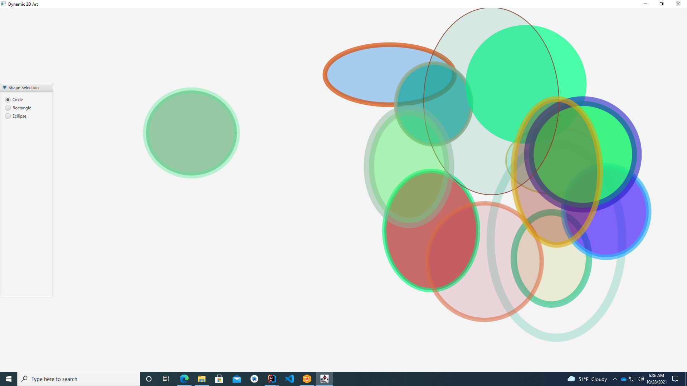

# Random2DArtWithCanvas

# PainterAppModification

###### By Jawad Haider
## Instruction
Write an app that continuously draws shapes of your choosing on a Canvas. Use random positions, sizes, locations, line widths, fills, and alpha transparencies. The shapes should randomly move around the Canvas in different directions and at different speeds.

## Software Requirements:
1. Scene Builder installation
[Official site](https://gluonhq.com/products/scene-builder/) to download Scene Builder.

2. [Official site](https://openjfx.io/) of JavaFX where you can find official documentation as well as download links.
Step-by-step [instructions](https://openjfx.io/openjfx-docs/) on how to install and run JavaFX applications.

=> --module-path ${PATH_TO_JAVAFX} --add-modules javafx.controls,javafx.fxml

## ScreenShots

